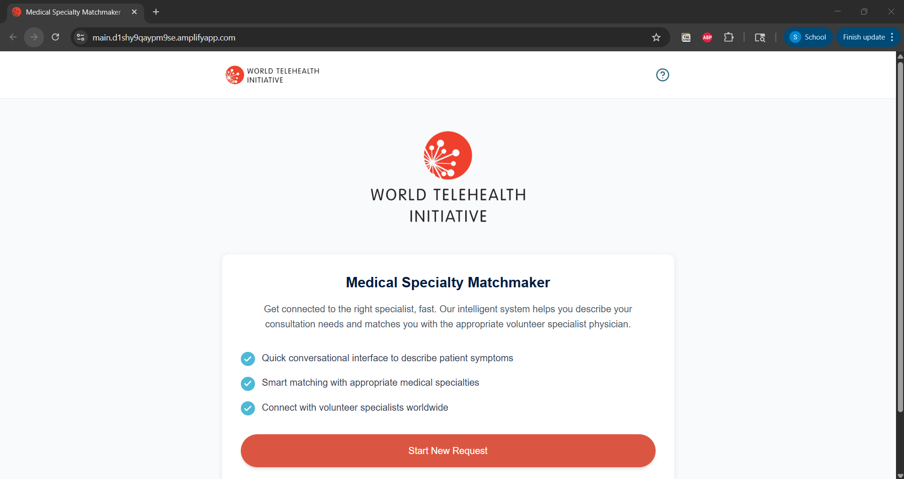
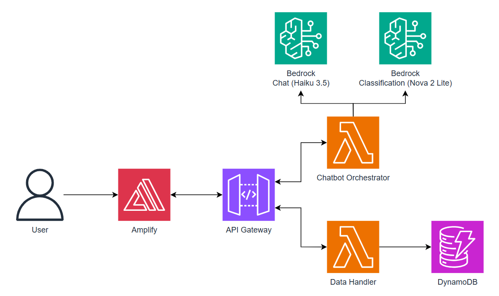

# Medical Specialty Matchmaker

An AI-powered medical triage system that helps healthcare professionals in resource-constrained settings connect with volunteer medical experts worldwide. The system uses AWS Bedrock AI to intelligently classify medical cases and match them with appropriate specialists.

## Demo Video

Watch the complete demonstration of Medical Specialty Matchmaker:

<div align="center">
<a href="[INSERT_DEMO_VIDEO_URL]">

</a>
<p><em>Click the image above to watch the demo</em></p>
</div>

> **[PLACEHOLDER]** Please provide a demo video thumbnail image and save it as `docs/media/demo-thumbnail.png`, and update the video URL link above.

## Index

| Description           | Link                                                  |
| --------------------- | ----------------------------------------------------- |
| Overview              | [Overview](#overview)                                 |
| Architecture          | [Architecture](#architecture-diagram)                 |
| Detailed Architecture | [Detailed Architecture](docs/architectureDeepDive.md) |
| Deployment            | [Deployment](#deployment)                             |
| User Guide            | [User Guide](docs/userGuide.md)                       |
| API Documentation     | [API Documentation](docs/APIDoc.md)                   |
| Infrastructure        | [Infrastructure](docs/architectureDeepDive.md)        |
| Modification Guide    | [Modification Guide](docs/modificationGuide.md)       |
| Model Justification   | [Model Justification](docs/modelJustification.md)     |
| Credits               | [Credits](#credits)                                   |
| License               | [License](#license)                                   |

---

## Overview

This application combines AI-powered conversational intelligence with systematic medical triage to connect healthcare professionals with appropriate specialists. Built on a serverless AWS architecture with dual AI models, the system provides intelligent case classification across 30+ medical specialties and 200+ subspecialties, enabling sustainable medical expertise delivery to resource-constrained hospitals and clinics globally.

### Key Features

- **AI-Powered Triage** powered by AWS Bedrock with Claude 3.5 Haiku and Amazon Nova 2 Lite
- **Conversational Interface** with intelligent follow-up questions to gather necessary information
- **Multi-Specialty Support** covering 30+ primary specialties and 200+ subspecialties
- **Pediatric & Adult Routing** with age-appropriate specialty matching
- **Confidence Scoring** with 90% threshold for subspecialty classification
- **Privacy-First Design** with no personally identifiable patient information collected
- **Real-time Classification** providing immediate specialty recommendations
- **Request Management** with DynamoDB storage and retrieval capabilities

## Architecture Diagram



The application implements a serverless, event-driven architecture with AI-powered classification at its core, combining conversational intelligence with systematic medical triage.

For a detailed deep dive into the architecture, including core principles, component interactions, data flow, security, and implementation details, see [docs/architectureDeepDive.md](docs/architectureDeepDive.md).

## User Flow

For a detailed overview of the user journey and application workflow, including step-by-step user interactions, see [docs/userGuide.md](docs/userGuide.md).

## Deployment

Deploying Medical Specialty Matchmaker requires AWS CLI and CDK. The deployment can be done from your local machine or AWS CloudShell:

1. **Configure AWS credentials**
   ```bash
   # For AWS SSO (recommended)
   aws sso login --profile your-profile-name
   export AWS_PROFILE=your-profile-name
   export AWS_REGION=us-west-2
   ```

2. **Clone the repository**
   ```bash
   git clone https://github.com/ASUCICREPO/Medical-Specialty-Matchmaker.git
   cd Medical-Specialty-Matchmaker
   ```

3. **Set up GitHub token (optional, for Amplify auto-deploy)**
   ```bash
   aws secretsmanager create-secret \
     --name "github-token" \
     --description "GitHub Personal Access Token for Amplify" \
     --secret-string "your-github-token-here" \
     --region us-west-2
   ```

4. **Run the deployment script**
   ```bash
   bash ./deploy.sh
   ```

The deployment script handles everything automatically, including:
- Prerequisites checking (Node.js, AWS CLI, CDK)
- Dependency installation
- CDK bootstrapping (if needed)
- Backend infrastructure deployment
- Frontend environment configuration
- Amplify build triggering

For detailed instructions, troubleshooting, and manual deployment steps, see [docs/deploymentGuide.md](docs/deploymentGuide.md).

## Usage

For detailed usage instructions, including:
- How to start a conversation
- Providing patient information
- Understanding classification results
- Submitting requests
- Privacy best practices

See [docs/userGuide.md](docs/userGuide.md).

## Infrastructure

For a detailed overview of the application infrastructure, including:
- Component interactions
- AWS services used
- Data flow
- Security considerations
- Scalability features

See [docs/architectureDeepDive.md](docs/architectureDeepDive.md).

## Documentation

- **[API Documentation](docs/APIDoc.md)** - Comprehensive API reference for all endpoints
- **[Architecture Deep Dive](docs/architectureDeepDive.md)** - Detailed system architecture and design
- **[User Guide](docs/userGuide.md)** - Step-by-step usage instructions
- **[Modification Guide](docs/modificationGuide.md)** - Guide for customizing and extending the system
- **[Model Justification](docs/modelJustification.md)** - Rationale for AI model selection

## Modification Guide

Steps to implement optional modifications such as:
- Changing the Bedrock models
- Adding new features
- Customizing the frontend
- Modifying classification logic
- Adding new specialties

Can be found [here](docs/modificationGuide.md).

## Resource Cleanup

To delete all AWS resources and avoid ongoing charges:

```bash
export AWS_PROFILE=your-profile-name
export AWS_REGION=us-west-2
bash ./destroy.sh
```

The destroy script will safely remove all deployed resources including Lambda functions, API Gateway, DynamoDB tables, and Amplify app.

---

## Credits

This application was developed to improve global healthcare access by connecting healthcare professionals in resource-constrained settings with volunteer medical experts worldwide.

Developed as part of the ASU Cloud Innovation Center initiative to provide sustainable medical expertise to underserved communities globally.

---

## License

See [LICENSE](LICENSE) file for details.
